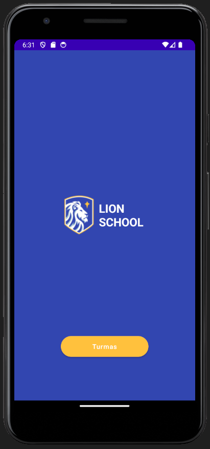

<h1><strong>Lion School</strong></h1>

|      MOBILE         |         
|:-------------------:|
|

## **Objetivo**

Desenvolver aplicativo para o projeto integrado [Lion School](https://github.com/camilapinh3iro/Projeto_Integrado_Lion_School).

## **Tecnologias Utilizadas**

- Kotlin
- Figma 

## **Figma**
Utilizando a ferramenta de design Figma, foi planejado o breakpoint. 
Segue o link: 

- [Link do Figma](https://www.figma.com/file/PejmtuFr6TD0a5Nu6aNeYy/SAS---MOBILE?type=design&node-id=0-1&t=Vpcp4sbd6PzwQH5d-0)

## **Autora**

| NOME                                                                                                                                                                                      |                                                     GITHUB                                                      |                                       FOTO                                       |
| :----------------------------------------------------------------------------------------------------------------------------------------------------------------------------------------- | :-------------------------------------------------------------------------------------------------------------: | :------------------------------------------------------------------------------: |
|  |      | </a> |